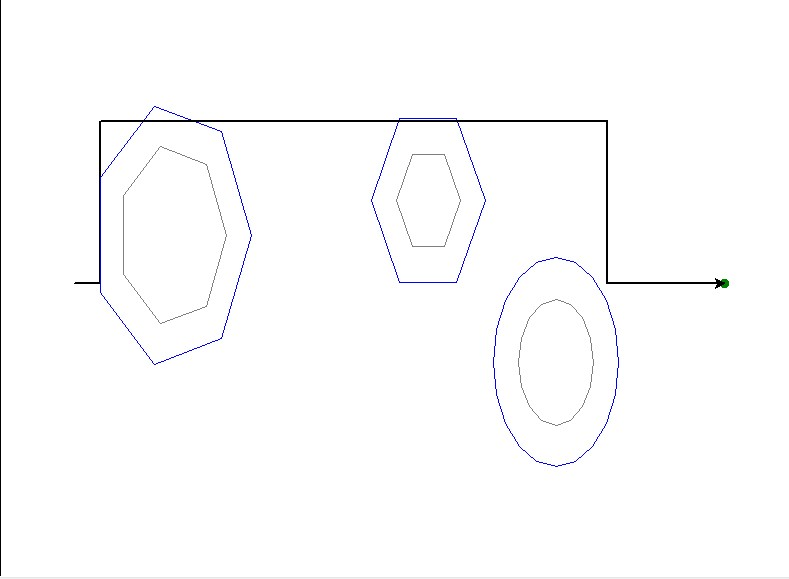

# TurtleBench — A Tiny Spatial Reasoning Benchmark for LLMs 🐢



**Status:** work in progress

## What & Why
**Goal:** test whether a large language model can read a simple 2D environment, plan a collision‑free path, and express it as primitive robot actions (`move(cm)`, `turn(deg)`) that are executed and scored.

Why this matters: it’s easy for LLMs to *sound* correct. What’s harder (and central to robotics/navigation) is spatial reasoning and decision‑making: understanding geometry, respecting clearances, and optimizing path length. This repo turns that into a tiny, repeatable benchmark.

---

## How it works (two scripts)
1. **`environment_generator.py`**  
   Creates `environment.txt` describing:
   - Canvas: `SCREEN_WIDTH`, `SCREEN_HEIGHT`
   - Start pose: `START_X`, `START_Y`, `START_HEADING_DEG`
   - Goal: `GOAL_X`, `GOAL_Y`, `GOAL_RADIUS_CM`
   - Robot geometry & safety: `ROBOT_SHAPE` (`rect|circle|polygon`),  
     `ROBOT_WIDTH_CM`, `ROBOT_HEIGHT_CM` (rect), `ROBOT_RADIUS_CM` (circle),  
     `ROBOT_POLY_FACES`, `ROBOT_POLY_RADIUS_CM` (polygon), `CLEARANCE_CM`
   - Angle convention for turns: `TURN_CONVENTION = right_positive | left_positive`
   - Obstacles (repeatable lines):
     - Circles: `OBSTACLE=circle:cx,cy,r`
     - Regular polygons: `OBSTACLE=polygon:cx,cy,R,faces[,rot_deg]`

2. **`run_experiment.py`**  
   - Reads `environment.txt` and the LLM’s `instructions.txt` (one command per line).
   - Draws the scene with Python `turtle`, **inflating obstacles** by the robot’s circumradius + `CLEARANCE_CM` (Minkowski sum), so the robot can be treated as a point.
   - Replays commands and samples the trajectory to compute **metrics** and detect **collisions**.
   - Saves results to `metrics.json`.

---

## Expected I/O for the LLM
- **Input to the LLM:** `environment.txt` (+ your `systemprompt.txt` describing the task).
- **Output from the LLM:** `instructions.txt` with lines like:
  ```
  move(123.45)          # centimeters; positive=forward, negative=backward
  turn(-30)             # degrees; sign per TURN_CONVENTION in environment.txt
  ```
Only `move()` and `turn()` are allowed.

---

## Quickstart
```bash
# 1) Generate a random environment
python environment_generator.py

# 2) Ask your LLM agent to read environment.txt and write instructions.txt

# 3) Run the benchmark/visualizer + metrics
python run_experiment.py --env environment.txt --instructions instructions.txt
# (run with -h to see available flags)
```

---

## Metrics (what gets scored)
`run_experiment.py` prints and writes `metrics.json` with:
- **total_path_length_cm** — total distance traveled. Lower is better if goal reached w/out collisions.
- **reached_goal** — `true` if within `GOAL_RADIUS_CM` of the goal center.
- **collision_samples** — number of sampled points that penetrated inflated obstacles (0 is ideal).
- **min_clearance_cm** — smallest signed distance to inflated obstacles along the path (negative ⇒ collision).
- **final_x**, **final_y**, **final_heading_deg** — terminal pose.
- **turn_convention** — echoed for reproducibility.

**Suggested pass criteria:** `reached_goal == true` and `collision_samples == 0`. Compare `total_path_length_cm` across runs/models.

---

## Repo layout (suggested)
```
.
├─ environment_generator.py
├─ run_experiment.py
├─ environment.txt          # last generated environment
├─ instructions.txt         # LLM-produced actions
├─ systemprompt.txt         # task prompt for the LLM
├─ metrics.json             # output metrics (JSON)
└─ Images/
   └─ image1.png            # screenshot used in this README
```

---

## Roadmap / future work
- **Batch evaluation:** auto-generate N environments, run each model, aggregate success rate, mean path length, collision rate.
- **Harder worlds:** narrow passages, oriented rectangles, mixed polygonal obstacles, moving obstacles.
- **Robotics realism:** non-holonomic constraints, limited turn rates, odometry noise, time/energy metrics.
- **3D variants:** extend to simple 3D scenes.
- **Tool-use tracks:** allow the model to write helper code; still scored by the same metrics.

---

## Notes
- Angle sign is defined by `TURN_CONVENTION` in `environment.txt`.
- Code and design are **WIP**; much of it was authored with LLM assistance.
- Choose a license before publishing (MIT/Apache-2.0 are common for benchmarks).

Feedback and PRs welcome!
